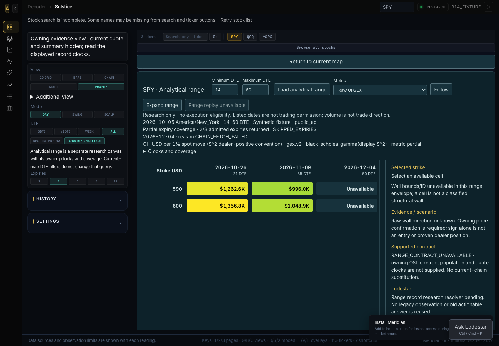
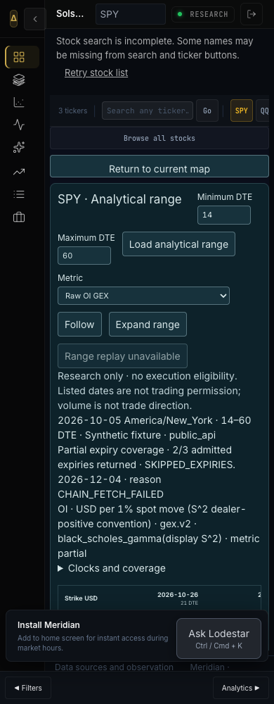
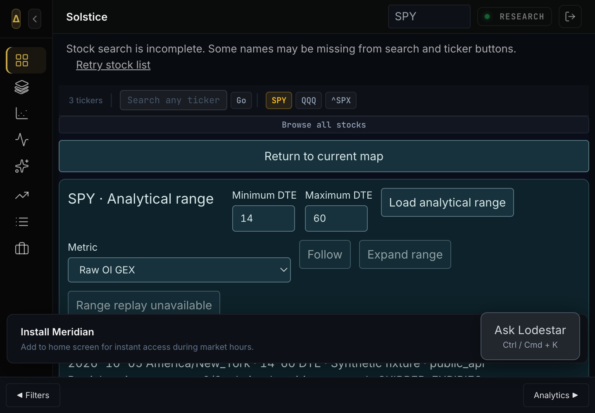

# R18 combined consumer acceptance — engineering HOLD

Prepared 3 October 2026. This is a reviewable successor, **not completed application acceptance or permission to commission**. Green gates establish tested behavior; they do not validate unsafe authority or supply missing producer APIs.

## Candidate and provenance

| Identity | Exact SHA / disposition |
|---|---|
| Main / release base | `6eaa3343655a30fd38c40abaa6a903e8d3814530`, unchanged |
| Common tested baseline | `22df6fe67463acc8a41283804e710d07dff105bd` |
| Prior Zed receipt | `77b8a1275bd896c0cfecb127fcd12821b7974e4a` |
| Composed Cline | `e6d35745061bdd83071047823aa5b12fb11e14e0` |
| Composed Spark | `a73f79b9e5dc202f496dfa9b554e466155bf2b5a` |
| Clean composition | `4e261dd17a3c2e2e3abba5c767b0fbaf401b22c2` |
| Consumer/runtime code | `47abd27b182f1996a2d1ae8dafcb9bc7f5db66d4` |
| Tested code + generated API docs | `bb13f96ae3e97e0bbd6ef92f2a3020998119bcb9` |
| Reviewed but NOT composed newer Spark | `5ac192dff14ddcab73316f01296ceff52b11c20f` |

`bb13f96a` changes only generated `docs/api` from `47abd27b`; `backend frontend scripts .github qc` diff is empty. The later receipt changes only Zed-owned documentation/evidence. Its exact SHA and hosted results are recorded in the PR104 closure rather than a self-referential commit claim.

Existing isolated lane: `.worktrees/zed-r17-integration-20261003`, branch `solstice/zed-r17-integration-20261003`. **[PR104](https://github.com/odaialdajani/floww-2/pull/104) is the single successor candidate.** PR103/105/106 stay open/reviewable; do not merge overlapping whole trees sequentially into main. Common baseline was fast-forwarded, then reviewed producer deltas merged with clean ancestry. No full-tree copying or peer checkpoint rewrite.

## Delivered consumer behavior

- Solstice's owning `range-analytics.v1` canvas defaults to14–60DTE and supports producer bounds0–365. Requests are explicit `GET .../range-analytics?...&persist=false`; no vendor/capture/model/execution request is triggered automatically by this canvas.
- Strict version, symbol/window/date/record-prefix, ordered axes/DTE, dense finite-or-null cells, available counts, metric registry/formula, coverage and clocks admission. Missing values remain unavailable, never zero. This is **shape/identity admission, not cryptographic evidence verification**.
- Raw OI GEX, delta-weighted OI GEX, cumulative volume gamma and window volume delta-adjusted gamma remain separate. Window history is visibly unavailable. Complete **expiry** coverage does not imply complete contract populations. Unknown OI effective/source dates remain unknown.
- Analytical mode unmounts legacy controls/canvas and releases legacy context ownership; the range child owns selection. Query/symbol/basis changes invalidate selection and stale replies; abort/generation guards prevent late restoration. Sidebar and map-toolbar controls share analytical mode. Adjacent current quote/summary/movers are hidden in owning analytical mode.
- Keyboard arrows, Follow, Expand, narrow stacked rail and native200% zoom are exercised. Null cells and skipped expiries remain visible. The rail distinguishes cell versus classified wall, conditional approach/confirmation hypotheses, unresolved exact contract, unavailable range research and unavailable execution.
- Legacy map Replay/Follow/Expand/GEX+VEX/Multimap and all eight workspace entries remain intact. Triad same-day support and Zenith are not relabeled as the range producer. All71 protected Tidehunter files remain unchanged; no conviction/score becomes execution authority.
- Existing authenticated agent preferences/provider bridge is extended, not duplicated. Scripted RPC through the actual CodexBridge proves owner save/load/isolation, exact `gpt-6.1-sol/xhigh/default` requested and effective settings, immutable request replay, policy/evidence/record/review-only draft linkage and error/timeout/cancel behavior. Fresh catalog effort/speed is rechecked before reservation. Terminal usage state and traces remain counted with unknown cost.
- Global range research refuses before provider routes while the range resolver is absent; backend request-spec probes also refuse `range-live`/`range-replay` before reads/provider. No current-chain substitute or old actionable answer is admitted.
- Manual Public brief adds explicit symbol/contract, **UNSET** limit/quantity/budget/conditions/window/expiry handling/notifications and risks. Recorded bid/ask never becomes an entry limit. One execution owner is selected. Copy is not delivery; saved private workflow references are operator reports, not remote acknowledgement/activation.

## Verification actually run

| Check | Result / source |
|---|---|
| Full backend, unmasked | **7176 passed,37 existing skips,2831 warnings;69.29% coverage**,286.86s, at `bb13f96a` |
| Full frontend | **128 suites /1183 passed**; rerun at `bb13f96a` |
| Storybook interactions + accessibility | **5 story files /33 passed**; current run at `bb13f96a` |
| Production build | Passed as part of compiled browser at `47abd27b`; runtime identical to `bb13f96a` |
| Storybook production build | Passed; Vite18.29s; same current runtime |
| Ruff / Bandit | Passed; both logs empty; full backend scope |
| Truth audit | **227 passed /0 failed** at `bb13f96a`; existing audit SKIP disclosures retained |
| Silent-except gate | Passed;**361 files** scanned |
| API docs | Failed freshness first; regenerated **once**; `--check` passes with **381 paths** |
| Actual route census | **392 operations**, no duplicate `(path,method)`; range GET mounted; execution-admission router unmounted |
| Compiled fixture browser | **8 routes /8 viewport captures**, native200% for legacy+range,683 source hashes match,0 page exceptions,0 execution mutations |
| Protected manifest | **71/71 committed and working hashes unchanged** |
| Authenticated offline Lodestar | **16 passed**; parent confirmation267 warnings; delegated adjacent agent sweep538 passed |
| Hosted required gates / Docker | Exact later receipt SHA/status recorded in PR104 closure; **pending at receipt preparation**, not borrowed from R17 or producer heads |

Commands and SHA256 log identities are in [validation-r18.json](evidence/validation-r18.json) and [gate summary](evidence/gate-summary.txt). Full local logs stay in `.verification/`; no swallowed failures, timeout masks, new skips or xfails. New helper/UI/mount/blank-input/research-refusal/population/spot/controlled-mode/native-brief regressions failed before their fixes. New provider acceptance initially11fail/4pass, then12fail/4pass before final16pass. A first parent test command had the wrong log-directory path and did not run; the corrected red invocation is recorded. One UI test guessed the skipped expiry, then was corrected to the verbatim producer fixture; its failure was not a product regression.

LocalPython3.14.6/Node24 differs from shippedPython3.12/Node20; hosted gates are the ship-runtime evidence. Browser evidence is **synthetic only**, retains20 console/resource warnings and the first-use install overlay; this is not Nav's visual approval. Bundle-size, Node deprecation and Storybook build warnings are not hidden.

## Engineering blockers — distinct from operator commissioning

### Cline: owning range replay, evidence and capture boundary

At composed `e6d35745`, `rga1` has service write/replay but no mounted index/retrieval API. Full canonical evidence metadata is not integrity-bound/verified on write/read; failed budget-debit/vendor-call behavior, admitted contract-population partiality, ticker-qualified production inspector and authenticated explicit capture are still requested. `persist=true` must not remain an unauthenticated GET-writing boundary. Exact contract resolver or explicit producer unavailable contract is required.

**Range replay is intentionally unavailable**, not implemented playback masquerading as persistence. Resume list/select/play/pause/step/speed/scrub/gap/empty/missing/corrupt/restart integration only after Cline supplies a versioned committed read contract and integrity proof. Existing Solstice replay remains separate. [Producer request](https://github.com/odaialdajani/floww-2/pull/106#issuecomment-5973799910). Cline standalone generated-doc freshness remains red unless its lane receives the authorized docs update; combined regeneration does not change that head.

### Spark: server-owned commissioned authority

Newer `5ac192df` was reviewed with41 committed-blob offline tests and no broker calls. Credited improvements do **not** close authority. Probes reproduce stored-approver spoofing/approval mutation, concurrent expired-lease grants, failed preflight accepted, armed no-policy existing `/order` bypass, proposed exposure/fee-loss omission and unknown order/native census admission. Principal/account/time/evidence binding is still incomplete. Approval fingerprint does not cover all exact executable payload fields.

Do not mount privileged writes, fabricate a principal from a shared-key bool or wire entry around these gaps. Required protection must refuse when unknown; preserve authenticated cancel/reconcile/exits through entry pauses. [Concrete reviewed repair request](https://github.com/odaialdajani/floww-2/pull/103#issuecomment-5974103701). `ADMIT`/`ACCEPTED` helpers are not commissioned, filled, protected or profitable. Newer reviewed head is not composed or described as all-green.

## Commissioning / continuation

[Concrete commissioning packet](../integration/COMMISSIONING.md) separates NAV-ACCOUNT/rights/policy, NAV-CAPTURE, NAV-MODEL, NAV-NATIVE, NAV-VISUAL and NAV-RELEASE. Values remain **UNSET**, activation **OFF**, outcome evidence **INSUFFICIENT**. No main merge, deployment, existing-service restart, activation, order, paid model turn or profitability guarantee.

[Continuation queue](ZED_R18_CONTINUATION.md) records precise remaining dependencies and next actions; producer repair did not block independent consumer work. Actual editor identifies GPT-6.1-Sol; editor effort is not exposed, so xhigh is **not claimed verified**. Scripted product dispatch is not a paid production turn. Available tools are file/search/terminal/fetch/skills and finite local browser workflows; no exposed authenticated Context7/Public/Storybook/Sentry/Figma MCP. No plugin installations or CRA/CRACO/Tailwind migration.

## Review images

