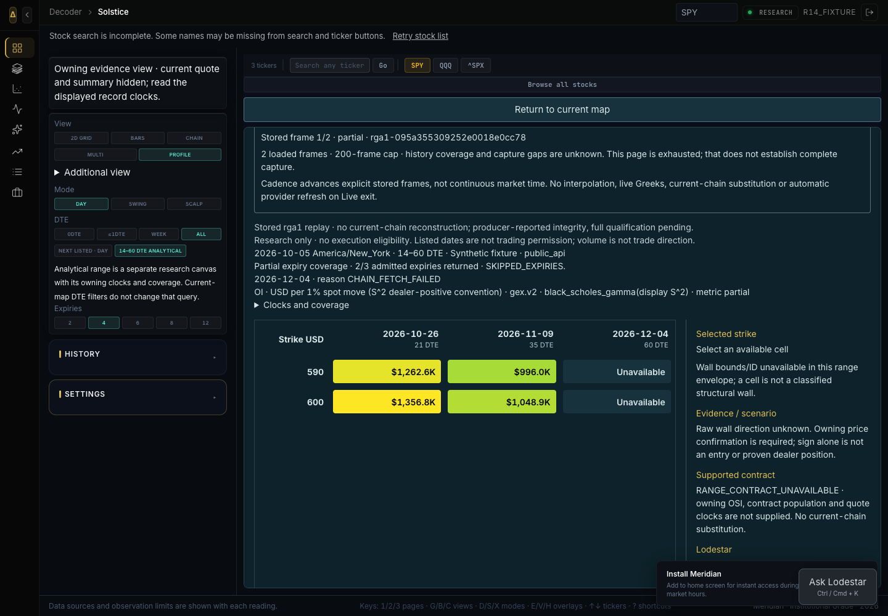
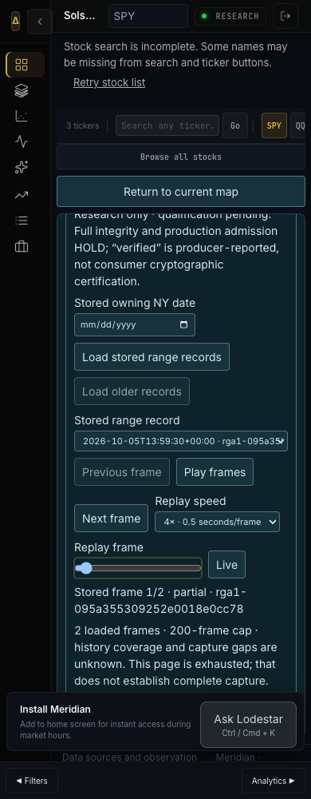
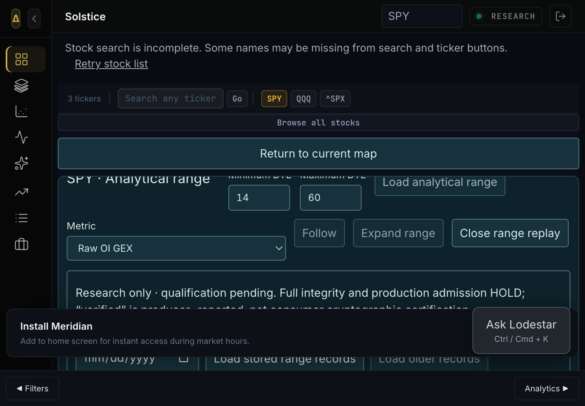

# R18 stored replay + Lodestar — combined engineering HOLD

Current tested candidate **`4bc20b69c599535a1c4e80fa21a5c62357e4284c`**. Consumer source `8810877e246b011918d1a0de120daae45ab57dbe`, research-boundary fix `67d697e20cf7c17ba7e2614f234eff3f07235da8`, scroll/menu fixes `c0747043155ba89fd08db46d22c361bf8fdd6fa5` / `9b9b1887e5d88c2ef11d7471beb79e27afe30272`. Receipt d8078bad is documentation/evidence only. Its exact hosted CI/CD37201832931 printed7390pass/38skip at14m50 but failed the15m step deadline; Docker skipped, frontend/Ruff succeeded. A subsequent material CI budget repair grants20m full-suite completion while preserving45m job/per-test120s/assertions/coverage/filter/fail-on-error. Application/source bytes remain identical; new exact SHA/hosted results are recorded in PR104 closure, not inferred or labelled green from test counts.

| Provenance | Exact identity / disposition |
|---|---|
| Main | `6eaa3343655a30fd38c40abaa6a903e8d3814530`, unchanged |
| Common baseline | `22df6fe67463acc8a41283804e710d07dff105bd` |
| Consumed Spark | `1d3401990036415076874a862c9e3c97e5bf7875` |
| Consumed Cline checkpoint | `a737df2d6fba7bf992b221714a287869da1fb940` |
| Consumed Cline runtime | `c085f8fb69204e4584b41bbf4adecc663456d12e` |
| Reviewed/rejected Cline v3 | `a0c7fbc64c5d91513fcdaecfdeb783d5bdee3f34`; not composed |
| Successor | [PR104](https://github.com/odaialdajani/floww-2/pull/104), review-only; overlapping PR103/105/106 remain reviewable |

Clean branch deltas/provenance only, no overlapping whole-tree copying or sequential main merges. Primary remains dirty at9a6c0295; every worktree, watchdog, peer checkpoint and frozen path preserved. **71/71 protected committed+working hashes match.**

## Delivered application consumers

- Production Solstice analytical canvas consumes actual owning axes/grids/clocks/null cells,14–60DTE default and0–365 supported queries. Explicit `persist=false`; expiry listing is still separate. Four registered metrics remain distinct, unknown clocks/populations explicit, volume not trade direction. Triad same-day capability and Zenith/legacy GEX+VEX/Multimap/Replay/Follow/Expand remain intact.
- **Stored rga1 research replay now works:** actual stored-only index/retrieval, list/select/play/pause/prev/next/speed/scrub, explicit50-row pages/200-frame cap, partial/null cells, empty/refused/missing/corrupt/version/header/count/key/query/symbol/late-response guards. Exact envelopes preserved verbatim; chronological frames are not continuous market-time coverage. Unknown gaps remain unknown. Deliberate Live exit does not fetch a current chain; active stored playback owns the existing live-poll pause signal.
- The actual producer GET handlers against synthetic memory DuckDB generated the consumer transport fixture—two exact records,404 missing,422 corrupt, empty index. Existing independent writer-exit/reader proof remains synthetic engineering evidence, not production survival. Legacy and rga1 replay namespaces stay separate.
- **Existing Lodestar is grounded in stored range cells:** fixed server recorder-read injection; strict request/wrapper/envelope/digest-consistency/schema/query/NY clocks/axes/registered metric/model/unit/count/selection checks. No current chain/map/flow/bars, model inspection or current-history substitution. Facts remain **degraded / research-only**, unknown event/OI dates unfilled, raw population explicitly unqualified.
- Existing owner preferences/provider path proves exact `gpt-6.1-sol/xhigh` requested/effective settings, ownership/isolation, policy/evidence/record/context/history/draft linkage, duplicate prevention/error/timeout/cancel with scripted RPC through actual CodexBridge. No duplicate provider route or paid product turn. Editor identifies GPT-6.1-Sol; editor effort remains unobservable.
- Range asks are explicit selected-cell questions through the same assistant, canonical `range:min:max` scope, frozen context and prior-selection labeling. Live range/window remain refused. Typed drafts retain `contract=None`, `review_only`, `executable=false`, `RANGE_CONTRACT_UNAVAILABLE` and `REPLAY_NOT_EXECUTABLE`.
- Manual native Public review remains editable copy/operator review for an admitted **legacy exact-contract** draft. Limit/quantity/budget/conditions/window/expiry/notifications/risks are explicit; unsupplied policy values UNSET. One selected execution owner. Local workflow reference/report is not Public delivery, trace ingestion or activation acknowledgement. No programmatic native creation is established.
- Scrollable owning canvas and in-flow range menus/disclosures keep the right rail reachable on small screens/native200%. No forced clicks or hidden warning removal. All eight workspace entries, saved/reviews/account/product navigation and protected Tidehunter implementation remain.

## New combined verification

All local runs below were performed for the new source. Backend/frontend/story/build/security results are not borrowed from R17 or earlier producer checkpoints.

| Gate | Actual result |
|---|---|
| Full backend, unmasked | **7303 passed /37 existing skips /3363 warnings;69.72% coverage**,408.70s at4bc20b69 |
| Full frontend | **130 suites /1369 passed** at4bc20b69 |
| Storybook interactions/accessibility | **36 passed /5 story files** at4bc20b69 |
| Production + Storybook builds | Passed at4bc20b69 |
| Ruff + Bandit | Passed; no findings |
| Truth / silent-except | **227 passed /0 failed**;**362 files** clean; existing truth-audit SKIP disclosures retained |
| API docs / actual route census | **383 paths /394 operations /no collisions**; stored list/retrieve and range read present; execution-admission module unmounted |
| Compiled fixture browser | **8 routes /10 viewport captures**, stored replay/model/keyboard/navigation controls, native200% legacy+range,**690 matching source hashes**,0 page exceptions/0 execution mutations |
| Protected manifest | **71/71 committed+working unchanged** |
| Hosted exact final receipt / Docker | Pending at receipt preparation; final SHA-bound closure on PR104 records actual success/failure—not inherited prior-head greens |

[Machine validation and command/log hashes](replay-evidence/validation-r18-final.json), [actual output summary](replay-evidence/gate-summary.txt), [compiled browser receipt](replay-evidence/browser-receipt.json). Full local logs retained in `.verification/`. Twenty browser console/resource warnings and the install overlay are disclosed; screenshots are synthetic, not Nav visual approval. LocalPython3.14.6/Node24 differ from ship3.12/20; hosted gates remain required.

### Failures preserved, not masked

- Exact old receipte55a53f7 hosted backend failed fork deployment tests then15-minute timeout; Docker skipped.
- First new backend84c4b505:7296pass/1fail/37skip/69.71%. **I introduced** the transitive producer/recorder import in research. Existing boundary test caught it; fixed the dependency with a pinned pure read-side v2 projection/conformance test, not an allowlist change. Red boundary/conformance then97 focused pass; full67d697e2 then7298 pass; later Spark delta followed by current7303 pass.
- Compiled browser built but stalled at range Ask; unawaited watcher initially prevented receipt. Awaited actions/watchers now record failures. Diagnostics measured2251px visible canvas under789px hidden parent; fixed bounded scrolling/select width. Next actual menu item was intercepted by persistent disclosure sharing an absolute popup class; moved warning/menu to normal flow and cleared stale notices. [Scroll failure](replay-evidence/browser-failed-scroll.json) / [menu failure](replay-evidence/browser-failed-menu.json) retained; final actual clicks pass.
- Meaningful helper/shape/count/verbatim-envelope/mounted context/clock/query/owner/provider/wiring/pause/disclosure tests failed first. Existing test-only WebCrypto setup was added to the new UI harness; no product workaround. No new skip/xfail, timeout mask or swallowed full-gate failure.

## Remaining engineering HOLD — not operator-only

### Cline

Admitted v2 reads/capture gate are credited. Full canonical/integrity/population/production qualification and exact-contract resolver remain incomplete. The reviewed v3 delta improves several pieces but **is rejected for this candidate**:

1. Published partial fixture says `synthetic:false`, admitted3 but returned0+skipped1, finite4 cells; it contaminates a production census. Correct and regenerate producer identity/wrappers; never relabel or relax coverage in the consumer.
2. Adjacent budget scope18pass/2fail: concurrent one fanout spends16 instead of4; cancellation during broker initialization leaks one slot at all three seams. Coalesce admission/debit and protect cleanup without authenticating/accounts before denied admission.
3. Duplicate writer still bypasses full row binding; malformed clocks can raise rather than refuse. Delta/volume exclusions and production/actual-session qualification still overclaim.
4. No recoverable owning stored OSI/quotes resolver exists. Range contract/native drafting remains unavailable, not supplied by a digest/reference.

[Precise v3 repair request](https://github.com/odaialdajani/floww-2/pull/106#issuecomment-5979463755). V2 research uses independent wrapper/header/digest-consistency guards and ignores unbound top metrics; this is not origin or full-integrity certification. No current-chain historical reconstruction.

### Spark

Credit stop/TIF/order-type binding, malformed/nonfinite/factory refusals, strict approval restart/revocation, serialized acquisition and fee loss. Pure helper/test passes do **not** close these reproduced boundaries:

- Authoritative stored approver differs from supplied copy; approval row remains mutable/non-atomic against revocation.
- Effects occur before lease-loss detection; failed preflight becomes cached usable.
- Armed no-store/no-policy `/order` bypass and commissioned risk/preflight/census/recovery/protection omissions persist.
- Raw approval ingestion bypasses factory restrictions; stored equity symbol can bypass expired OSI guards; instrument/session and exact numeric payload binding still incomplete.
- Existing+proposed+reserved exposure and unknown/NULL/incomplete census are not fail-closed; named principal/server time/trusted evidence are not completed by body strings/master-key bool.

[Latest concrete review request](https://github.com/odaialdajani/floww-2/pull/103#issuecomment-5979463886). **No privileged admission-router mount or arming.** Existing live-enable/paper boundaries and authenticated cancel/reconcile/exit availability remain preserved. ADMIT/ACCEPTED is not commissioned/filled/protected/profitable.

## Commissioning / release

[Concrete commissioning packet](../integration/COMMISSIONING.md) separates **NAV-ACCOUNT/rights/policy**, **NAV-CAPTURE production+restart records**, **NAV-MODEL actual owner settings/authorized turn**, **NAV-NATIVE workflow/protection**, **NAV-VISUAL** and **NAV-RELEASE**. All production account/risk values remain UNSET. No main merge, deployment, existing-service restart, activation, order or paid product turn occurred. Measured net outcomes remain INSUFFICIENT EVIDENCE; no profitability guarantee.

[Current continuation](ZED_R18_CONTINUATION.md) retains producer ownership and next admitted READY actions. No Context7/authenticated Public/Storybook/Sentry/Figma MCP exposure, plugin installation or CRA/CRACO/Tailwind migration is claimed.

